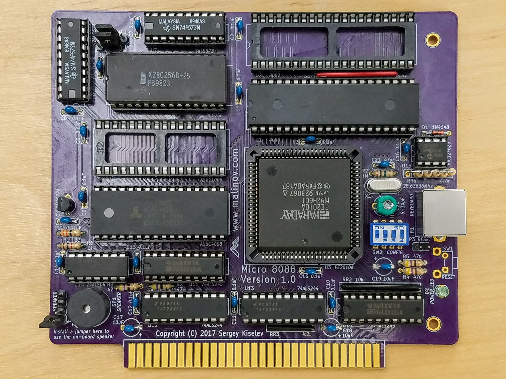

# Micro 8088
IBM XT Compatible Processor Board based on Faraday FE2010 chipset

## Introduction
This project is an attempt to create a simple to build IBM PC/XT compatible processor board.
The project uses a fairly common Faraday FE2010/FE2010A chipset, that implements most of IBM PC/XT LSIs (Intel 8xxx ICs) and glue logic.

## Specifications
* Processor: Intel 8088 or compatible, NEC V20
  * Supports IBM PC/XT standard 4.77 MHz CPU frequency, and (when using FE2010A chipset) 7.16 MHz and 9.54 MHz CPU frequencies
* Coprocessor: Intel 8087
* Faraday FE2010/FE2010A chipset, implementing the following components:
  * One 8237 direct memory access controller (DMAC)
  * One 8259 programmable interrupt controller (PIC)
  * One 8254 programmable interval timer (PIT)
  * One 8255 programmable peripheral interface (PPI)
  * Clock generation, and glue logic
* RAM: 512 KiB or 640 KiB base memory; Up to 192 KiB UMBs. Implemented using SRAM
* ROM: 64 KiB. Implemented using 128 KiB Flash ROM
* 8-bit ISA interface
* PS/2 compatible keyboard connector; built in AT2XT converter

## Hardware Documentation

### Schematic and PCB Layout

[Schematic - Version 1.1](KiCad/8088-FE2010A-SBC-Schematic-1.1.pdf)

[PCB Layout - Version 1.1](KiCad/8088-FE2010A-SBC-Board-1.1.pdf)

### Bill of Materials - Version 1.1

Component type    	| Reference | Description                       | Quantity | Possible sources and notes 
------------------ | --------- | --------------------------------- | -------- | --------------------------
PCB                |           | Micro 8080 PCB - Version 1.0      | 1        | Order from [OSH Park](https://oshpark.com/shared_projects/H4fbhjaD)
Integrated Circuit | U1        | Intel 8088, 80C88, or NEC V20 CPU | 1        | eBay, Mouser (expensive) - [968-IP80C88-2](https://www.mouser.com/Search/ProductDetail.aspx?R=IP80C88-2virtualkey57760000virtualkey968-IP80C88-2)
Integrated Circuit | U2        | Intel 8087 FPU                    | 1        | Optional, eBay
Integrated Circuit | U3        | Faraday FE2010A                   | 1        | eBay
Integrated Circuit | U4        | SST39SF010A Flash ROM, DIP-32 package | 1    | Mouser
Integrated Circuit | U5, U6    | AS6C4008 SRAM, DIP-32 package     | 2        | Mouser [913-AS6C4008-55PCN](https://www.mouser.com/Search/ProductDetail.aspx?R=AS6C4008-55PCNvirtualkey56240000virtualkey913-AS6C4008-55PCN)
Integrated Circuit | U7 - U9   | 74F573 Octal D-Type Latch         | 3        | Mouser
Integrated Circuit | U10, U11  | 74F245 Octal Bus Transceiver      | 2        | Mouser
Integrated Circuit | U12, U13  | 74F244 Octal Buffer               | 2        | Mouser
Integrated Circuit | U14       | 74F00 Quad 2-Input NAND Gate      | 1        | Optional - install either U14 or U16. Mouser
Integrated Circuit | U15       | PIC12F629 Microcontroller         | 1        | Mouser [PIC12F629-I-P](https://www.mouser.com/Search/ProductDetail.aspx?R=PIC12F629-I%2fPvirtualkey57940000virtualkey579-PIC12F629IP)
Integrated Circuit | U16       | ATF16V8B SPLD                     | 1        | Optional - install either U14 or U16. Mouser
IC Socket          | U1, U2    | DIP-40, 600 mil socket            | 2        | Mouser [517-4840-6000-CP](https://www.mouser.com/Search/ProductDetail.aspx?R=4840-6000-CPvirtualkey51750000virtualkey517-4840-6000-CP)
IC Socket          | U3        | PLCC-84 through hole socket       | 1        | Mouser [517-8484-11B1-RK-TP](https://www.mouser.com/Search/ProductDetail.aspx?R=8484-11B1-RK-TPvirtualkey51750000virtualkey517-8484-11B1-RK-TP)
IC Socket          | U4-U6     | DIP-32, 600 mil socket            | 3        | Mouser [517-4832-6000-CP](https://www.mouser.com/Search/ProductDetail.aspx?R=4832-6000-CPvirtualkey51750000virtualkey517-4832-6000-CP)
IC Socket          | U7-U13, U16 | DIP-20, 300 mil socket          | 8        | Mouser [517-4820-3000-CP](https://www.mouser.com/Search/ProductDetail.aspx?R=4820-3000-CPvirtualkey51750000virtualkey517-4820-3000-CP)
IC Socket          | U14       | DIP-14, 300 mil socket            | 1        | Mouser [517-4814-3000-CP](https://www.mouser.com/Search/ProductDetail.aspx?R=4814-3000-CPvirtualkey51750000virtualkey517-4814-3000-CP)
IC Socket          | U15       | DIP-8, 300 mil socket             | 1        | Mouser [517-4808-3000-CP](https://www.mouser.com/Search/ProductDetail.aspx?R=4808-3000-CPvirtualkey51750000virtualkey517-4808-3000-CP)
Diode              | D1        | 1N4148                            | 1        | Mouser [512-1N4148](https://www.mouser.com/Search/ProductDetail.aspx?R=1N4148virtualkey51210000virtualkey512-1N4148)
LED                | D2        | 3 mm, green LED indicator         | 1        | Mouser [LTL-4231NHBP](https://www.mouser.com/Search/ProductDetail.aspx?R=LTL-4231NHBPvirtualkey57820000virtualkey859-LTL-4231NHBP)
Transistor         | Q1        | PN2222A, 2.54mm lead spacing      | 1        | Mouser [512-PN2222ATA](https://www.mouser.com/Search/ProductDetail.aspx?R=PN2222ATAvirtualkey51210000virtualkey512-PN2222ATA)
Crystal            | X1        | 28.63636 MHz, 18 pF, HC-49/S      | 1        | Mouser [717-9B-28.63636MEEJB](https://www.mouser.com/Search/ProductDetail.aspx?R=9B-28.63636MEEJ-Bvirtualkey57230000virtualkey717-9B-28.63636MEEJB)
Speaker            | SP1       | 12 mm speaker                     | 1        | Mouser [665-AT-1224TWTR](https://www.mouser.com/Search/ProductDetail.aspx?R=AT-1224-TWT-Rvirtualkey66500000virtualkey665-AT-1224TWTR)
Tactile Button     | SW1       | 6 mm tactile button, right angle  | 1        | Mouser [653-B3F-3152](https://www.mouser.com/Search/ProductDetail.aspx?R=B3F-3152virtualkey65300000virtualkey653-B3F-3152)
DIP Switch         | SW2       | 3 positions                       | 1        | Mouser
DIP Switch         | SW3       | 5 positions                       | 1        | Mouser
Connector          | P1        | 6 pin Mini DIN, purple            | 1        | Mouser [806-KMDGX-6S-BS2715C](https://www.mouser.com/Search/ProductDetail.aspx?R=KMDGX-6S-BS2715Cvirtualkey51700000virtualkey806-KMDGX-6S-BS2715C)
Pin Header         | P2, JP3-JP4 | 4 pin header, 2.54 mm pitch     | 2        | Mouser [649-68002-104HLF](https://www.mouser.com/Search/ProductDetail.aspx?R=68002-104HLFvirtualkey64910000virtualkey649-68002-104HLF)
Pin Header         | P3, JP1-JP2 | 2 pin header, 2.54 mm pitch     | 3        | Mouser [649-68002-102HLF](https://www.mouser.com/Search/ProductDetail.aspx?R=68002-102HLFvirtualkey64910000virtualkey649-68002-102HLF)
Capacitor          | C1 - C17  | 0.1 uF, MLCC, 5 mm lead spacing   | 17       | Mouser [594-K104K15X7RF53H5](https://www.mouser.com/Search/ProductDetail.aspx?R=K104K15X7RF53H5virtualkey59420000virtualkey594-K104K15X7RF53H5)
Capacitor          | C18 - C20 | 10 uF, MLCC, 5 mm lead spacing    | 3        | Mouser [810-FG24X7R1A106KRT0](https://www.mouser.com/Search/ProductDetail.aspx?R=FG24X7R1A106KRT00virtualkey52130000virtualkey810-FG24X7R1A106KRT0)
Trimmer Capacitor  | C21       | 6.5-30 pF, 5 mm lead spacing      | 3        | Mouser [659-GKG30015](https://www.mouser.com/Search/ProductDetail.aspx?R=GKG30015virtualkey65900000virtualkey659-GKG30015)
Capacitor          | C22       | 47 pF, MLCC, 5 mm lead spacing    | 1        | Mouser [810-FG28C0G1H470JNT0](https://www.mouser.com/Search/ProductDetail.aspx?R=FG28C0G1H470JNT00virtualkey52130000virtualkey810-FG28C0G1H470JNT0)
Capacitor          | C23       | 0.01 uF, MLCC, 5 mm lead spacing  | 1        | Mouser [594-K103K15X7RH5TH5](https://www.mouser.com/Search/ProductDetail.aspx?R=K103K15X7RH5TH5virtualkey59420000virtualkey594-K103K15X7RH5TH5)
Resistor Array     | RR1       | 4.7 k, bussed, 10 pin SIP         | 1        | Mouser [266-4.7K-RC](https://www.mouser.com/Search/ProductDetail.aspx?R=266-4.7K-RCvirtualkey21980000virtualkey266-4.7K-RC)
Resistor Array     | RR2       | 10 k, bussed, 10 pin SIP          | 1        | Mouser [266-10K-RC](https://www.mouser.com/Search/ProductDetail.aspx?R=266-10K-RCvirtualkey21980000virtualkey266-10K-RC)
Resistor Array     | RR3, RR4  | 4.7 k, bussed, 6 pin SIP          | 2        | Mouser [264-4.7K-RC](https://www.mouser.com/Search/ProductDetail.aspx?R=264-4.7K-RCvirtualkey21980000virtualkey264-4.7K-RC)
Resistor Array     | RR5       | 10 k, bussed, 6 pin SIP           | 1        | Mouser [264-10K-RC](https://www.mouser.com/Search/ProductDetail.aspx?R=264-10K-RCvirtualkey21980000virtualkey264-10K-RC)
Resistor           | R1        | 33 ohm, through hole              | 1        | Mouser [291-33-RC](https://www.mouser.com/Search/ProductDetail.aspx?R=291-33-RCvirtualkey21980000virtualkey291-33-RC)
Resistor           | R2, R3    | 47 ohm, through hole              | 2        | Mouser [291-47-RC](https://www.mouser.com/Search/ProductDetail.aspx?R=291-47-RCvirtualkey21980000virtualkey291-47-RC)
Resistor           | R4, R5    | 470 ohm, through hole             | 2        | Mouser [291-470-RC](https://www.mouser.com/Search/ProductDetail.aspx?R=291-470-RCvirtualkey21980000virtualkey291-470-RC)
Resistor           | R6        | 1 kohm, through hole              | 1        | Mouser [291-1K-RC](https://www.mouser.com/Search/ProductDetail.aspx?R=291-1K-RCvirtualkey21980000virtualkey291-1K-RC)
Resistor           | R7        | 10 kohm, through hole             | 1        | Mouser [291-10K-RC](https://www.mouser.com/Search/ProductDetail.aspx?R=291-10K-RCvirtualkey21980000virtualkey291-10K-RC)
Resistor           | R8        | 1 Mohm, through hole              | 1        | Mouser [291-1M-RC](https://www.mouser.com/Search/ProductDetail.aspx?R=291-1M-RCvirtualkey21980000virtualkey291-1M-RC)
ISA Bracket        |           | Keystone Electronics 9202         | 1        | Mouser [534-9202](https://www.mouser.com/Search/ProductDetail.aspx?R=9202virtualkey53400000virtualkey534-9202)
Screw              |           | 4-40 x 1/4" Screw                 | 2        | Mouser [534-9900](https://www.mouser.com/Search/ProductDetail.aspx?R=9900virtualkey53400000virtualkey534-9900)

### Faraday FE2010/FE2010A Specifics
This section documents features and quirks that are specific to Micro 8088, and to
Faraday FE2010 and FE2010A chipsets, and not present in standard IBM PC/XT.

#### CPU Clock Frequency / Turbo Mode Switching
This appears to be implemented only in Faraday FE2010A chipset (not in FE2010).
* XSEL signal (pin 18) of FE2010A (U3) used to select between 14.31818 MHz and 28.63636 MHz crystal frequency.
This signal should be pulled up for 14.31818 MHz and grounded for 28.63636 MHz. On Micro 8088 this signal is connected to JP2:
JP2 should be OPEN for 14.31818 MHz and CLOSED for 28.63636 MHz.
* Port 63h is used to select chipset configruation, including the CPU frequency:

Port 63h bit | Function
------------ | --------
0            | disable parity
1            | 8087 present (enable 8087 NMI)
2            | 256K RAM (1 bank)
3            | lock register (bits 0-4)
4            | 512K RAM size (2 banks)
5            | memory wait states (on ISA bus)
6            | 7.16 MHz CPU clock
7            | 9.54 MHz CPU clock

* According to the available documentation (Intel Wildcard 88 module, which appears to be using the same chipset):
  * Bit 5 controls the number of wait states when accessing memory on ISA bus:
    * Bit 5 == 0, 7.16 MHz CPU clock: 2 wait states
    * Bit 5 == 0, 9.54 MHz CPU clock: 4 wait states
    * Bit 5 == 1: 0 wait states, regardless of CPU clock
    * On-board memory (that is memory in range 0x0000 - 0x9FFFF, first 640 KiB) always accessed with 0 wait states
    * ROM memory (0xF0000h-0xFFFFF range) is always accessed with 0 wait states for 4.77 MHz, 2 wait states for 7.16 MHz clock, and 4 wait states for 9.54 MHz clock
* Some findings from my tests:
  * Setting bit 7 to 1 seems to override bit 6 value
  * When using 28.63636 MHz crystal (XSEL pin is grounded), setting bit 7 switches CPU clock frequency to 9.54 MHz, regardless of bit 6
  * When using 14.31818 MHz crystal (XSEL pin is pulled up), setting bit 7 switches CPU clock frequency to 4.77 MHz, regardless of bit 6
  * When using 14.31818 MHz crystal (XSEL pin is pulled up)
  * It appears that CPU clock duty cycle is 50% (excluding 4.77 MHz setting with 28.63636 MHz crystal, where duty cycle is 33%). This potentially can cause issues with some 8088 CPUs.
  
## Changes
* Version 1.1
  * Recommend using 74F-series, and update the schematic and the silkscreen accordingly. 74F-series ICs are faster and slightly cheaper than 74ALS-series
  * Add 74F573 latch for latching A8-A11 signals. This fixes the DMA issue
  * Use 74F244 to buffer OSC and CLK signals
  * Use AS6C4008 for the second SRAM (U6) instead of AS6C1004. This resolves the AS6C1004 TTL compatibility issue
  * Use 74F00 for generating chip select signal for the second SRAM (U6), and for inverting the speaker signal
  * Add an optional SPLD (U16) to implement UMBs
  * Use 128 KiB Flash ROM instead of 32 KiB EEPROM. It is cheaper, and has twice more storage space
  * Use buffered /MEMR and /MEMW signals for SRAM and BIOS ROM
  * PCB dimensions changed from 5" x 4.3" to 6" x 4"
* Version 1.0
  * Initial version

## Known Issues
* Version 1.1
  * JP2 description on the back silkscreen suggests that the default JP2 position is *Open*. Since the recommended chipset is FE2010A and the recommended crystal frequency is 28.63636 MHz, the default JP2 position should be *Closed*
* Version 1.0
  * System does not boot with NEC V20 CPU.
    * This is confirmed to be due to a Phoenix BIOS issue (BIOS image from Intel Wildcard 88)
    * Xi 8088 BIOS is currently work in progress, and it doesn't suffer from this issue
  * AS6C1008 (U6) does not have TTL compatible inputs causing instability with 640 KiB memory configruation
    * Workaround: use CMOS transceiver U11, e.g. 74AHCT245
  * DMA doesn't work properly.
    * This is due to A8-A11 address lines not beight latched.
    * Workaround: add a 74F573 latch, and connect AA8-AA11 and A8-AA11 through it

## TODO List
* Version 1.1
  - [ ] Build and test the board
  - [ ] Debug the Xi 8088 BIOS
* Version 1.0
  - [x] Test with 14.31818 MHz and 28.63636 MHz crystals
  - [x] Test 512 KiB and 640 KiB memory configuration
  - [x] Port Xi 8088 BIOS to Micro 8088
  - [x] Test with CMOS buffers, latches, and transceivers
