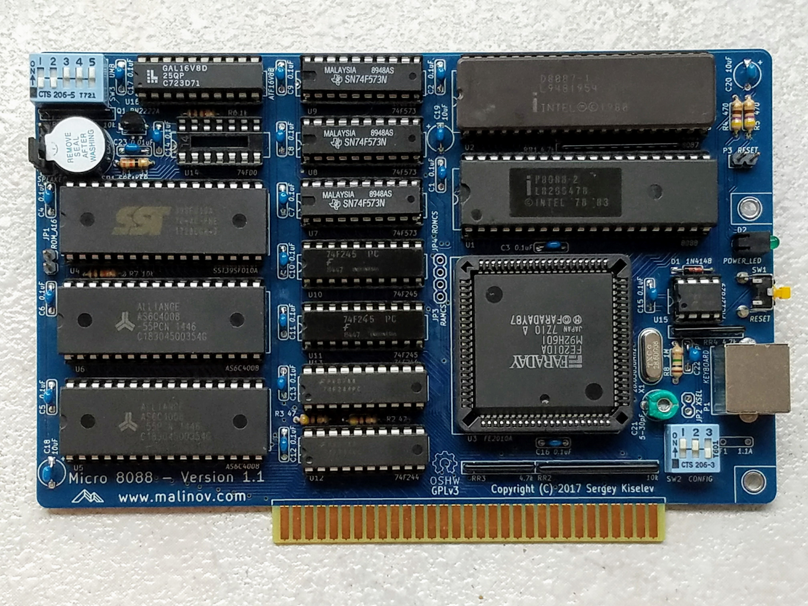

# Micro 8088
IBM XT Compatible Processor Board based on Faraday FE2010/FE2010A chipset

## Introduction
Micro 8088 is an easy to build IBM PC/XT compatible processor board. It uses a fairly common Faraday FE2010/FE2010A chipset, that implements most of IBM PC/XT LSIs (Intel 8xxx ICs) and glue logic. Micro 8088 uses SRAM ICs to implement the system RAM, and a Flash ROM IC to store the BIOS, further reducing the number of components, and simplifying the build process.

## Specifications
* Processor: Intel 8088 or compatible, NEC V20
  * Supports IBM PC/XT standard 4.77 MHz CPU frequency and, when using FE2010A chipset, 7.16 MHz and 9.54 MHz CPU frequencies
* Coprocessor: Intel 8087
* [Faraday FE2010/FE2010A](Documentation/Faraday-XT_Controller-FE2010A.md) chipset, implementing the following components:
  * One 8237 direct memory access controller (DMAC)
  * One 8259 programmable interrupt controller (PIC)
  * One 8254 programmable interval timer (PIT)
  * One 8255 programmable peripheral interface (PPI)
  * Clock generation, and glue logic
* RAM: 512 KiB or 640 KiB base memory; Up to 192 KiB UMBs. Implemented using SRAM
* ROM: 64 KiB. Implemented using 128 KiB Flash ROM
* 8-bit ISA interface
* PS/2 compatible keyboard connector; built in AT2XT converter

## Hardware Documentation

### Schematic and PCB Layout

[Schematic - Version 1.1](KiCad/8088-FE2010A-SBC-Schematic-1.1.pdf)

[PCB Layout - Version 1.1](KiCad/8088-FE2010A-SBC-Board-1.1.pdf)

[PCB Layout - Version 1.2](KiCad/8088-FE2010A-SBC-Board-1.2.pdf)

[PCB Layout - Version 1.3](KiCad/8088-FE2010A-SBC-Board-1.3.pdf)

### Building Insturctions

Please refer to [Building Instructions](Building_Instructions.md) page for detailed instructions.

### Faraday FE2010/FE2010A Information

Please refer to [Faraday FE2010A documentation](Documentation/Faraday-XT_Controller-FE2010A.md) and [Faraday FE2010 datasheet](Documentation/Faraday-XT_Controller-FE2010.pdf) for detailed information about Faraday FE2010/FE2010A chipsets.

*Note: CPU clock frequency switching (turbo mode) is only implemented in Faraday FE2010A chipset (not in FE2010).*

### Jumpers, Connectors, and Switches

#### P1 - PS/2 Keyboard
Pin | Description
--- | -----------
1   | Keyboard data
2   |	Unused
3   |	GND
4   |	+5V
5   |	Keyboard clock
6   |	Unused

#### P2 - Speaker
Pin | Description
--- | -----------
1   | Speaker output
2   | Internal Speaker input*
3   | Unused
4   |	+5V

*Note: To enable internal speaker connect a jumper across pins 1-2*

#### P3 - Reset Switch
Pin | Description
--- | -----------
1   | Reset input
2   | Ground

#### JP1 - Select Flash ROM area mapped to 0xF0000-0xFFFFF
Position | Description
-------- | -----------
*open (default)* | Map lower 64 KiB of the Flash ROM to 0xF0000-0xFFFFF
closed   | Map upper 64 KiB of the Flash ROM to 0xF0000-0xFFFFF

#### JP2 - Select X1 Crystal Frequency
Position | Description
-------- | -----------
open     | Use 14.31818 MHz crystal
*closed (default)* | Use 28.63636 MHz crystal

*Note: 14.31818 MHz crystal supports 4.77 MHz and 7.16 MHz CPU clock frequencies; 28.63636 MHz crystal additionally supports 9.55 MHz CPU clock frequency*

#### JP3 - RAM Chip Select Source
Position | Description
-------- | -----------
*open (default)* | Use SPLD (U16)
closed   | Use FE2010A (U3)

*Note: FE2010A only generates RAM chip select for the base RAM (lower 640 KiB). It does not generate RAM chip select for UMBs, and therefore SPLD (U16) is required to implement UMBs*

#### JP4 - Flash ROM Chip Select Source
Position | Description
-------- | -----------
*open (default)* | Use SPLD (U16)
closed   | Use FE2010A (U3)

*Note: FE2010A does not generate chip select for memory write cycles, therefore it does not support in-system BIOS upgrades*

#### SW1 - Reset Switch
Press SW1 to reset the system

#### SW2 - System Configuration
Position	| Description
-------- | -----------
SW2.1 = OFF, SW2.2 = OFF | MDA or Hercules
SW2.1 = ON, SW2.2 = OFF  | CGA, 80x25
SW2.1 = OFF, SW2.2 = ON  | CGA, 40x25
SW2.1 = ON, SW2.2 = ON   | None, EGA, or VGA
SW2.3 = OFF | Disable keyboard 0xE0 scan code pass through
SW2.3 = ON | Enable keyboard 0xE0 scan code pass through

#### SW3 - UMB Configuration
Position	| Description
-------- | -----------
SW3.1 = ON | Map 0xC0000-0xC7FFF to RAM 
SW3.2 = ON | Map 0xC8000-0xCFFFF to RAM 
SW3.3 = ON | Map 0xD0000-0xD7FFF to RAM 
SW3.4 = ON | Map 0xD8000-0xDFFFF to RAM 
SW3.5 = ON | Map 0xE0000-0xEFFFF to RAM

*Note: SPLD (U16) is required to implement UMBs. This switch is not used in systems without SPLD*

### Bill of Materials - Versions 1.1, 1.2, and 1.3

[Micro 8088 project on Mouser.com](https://www.mouser.com/ProjectManager/ProjectDetail.aspx?AccessID=57e2f0df1d) - View and order all components except of the Faraday FE2010A chipset, and the PCB.
[Micro 8088 project on OSH Park](https://oshpark.com/shared_projects/xbWzfre6) - View and order the PCB.

Component type    	| Reference | Description                       | Quantity | Possible sources and notes 
------------------ | --------- | --------------------------------- | -------- | --------------------------
PCB                |           | Micro 8080 PCB - Version 1.1, 1.2, or 1.3 | 1        | Refer to the [RetroBrew Computers Board Inventory](https://retrobrewcomputers.org/doku.php?id=boardinventory#xi_8088_project_sergey_kiselev) page for ordering information, or order from a PCB manufacturer of your choice using provided Gerber or KiCad files
Integrated Circuit | U1        | Intel 8088, 80C88, or NEC V20 CPU | 1        | eBay, Mouser (expensive) - [968-CP80C88-2Z](https://www.mouser.com/ProductDetail/968-CP80C88-2Z)
Integrated Circuit | U2        | Intel 8087 FPU                    | 1        | Optional, eBay
Integrated Circuit | U3        | Faraday FE2010A                   | 1        | eBay, can be replaced with [Proton PT8010AF](https://github.com/skiselev/micro_8088/blob/master/Documentation/Proton-XT_Controller-PT8010AF.md)
Integrated Circuit | U4        | SST39SF010A Flash ROM, DIP-32 package | 1    | Mouser [804-39SF010A7CPHE](https://www.mouser.com/ProductDetail/804-39SF010A7CPHE)
Integrated Circuit | U5, U6    | AS6C4008 SRAM, DIP-32 package     | 2        | Mouser [913-AS6C4008-55PCN](https://www.mouser.com/ProductDetail/913-AS6C4008-55PCN)
Integrated Circuit | U7 - U9   | 74F573 Octal D-Type Latch         | 3        | Mouser [595-SN74F573N](https://www.mouser.com/ProductDetail/595-SN74F573N)
Integrated Circuit | U10, U11  | 74F245 Octal Bus Transceiver      | 2        | Mouser [595-SN74F245N](https://www.mouser.com/ProductDetail/595-SN74F245N)
Integrated Circuit | U12, U13  | 74F244 Octal Buffer               | 2        | Mouser [595-SN74F244N](https://www.mouser.com/ProductDetail/595-SN74F244N)
Integrated Circuit | U14       | 74F00 Quad 2-Input NAND Gate      | 1        | Mouser [595-SN74F00](https://www.mouser.com/ProductDetail/595-SN74F00N). **Important note: install either U14 or U16, not both together**
Integrated Circuit | U15       | PIC12F629 Microcontroller         | 1        | Mouser [PIC12F629-I-P](https://www.mouser.com/ProductDetail/579-PIC12F629IP)
Integrated Circuit | U16       | ATF16V8B SPLD                     | 1        | Mouser [556-AF16V8B15PU](https://www.mouser.com/ProductDetail/556-AF16V8B15PU). **Important note: install either U14 or U16, not both together**
IC Socket          | U1, U2    | DIP-40, 600 mil socket            | 2        | Mouser [649-DILB40P223TLF](https://www.mouser.com/ProductDetail/649-DILB40P223TLF)
IC Socket          | U3        | PLCC-84 through hole socket       | 1        | Mouser [517-8484-11B1-RK-TP](https://www.mouser.com/ProductDetail/517-8484-11B1-RK-TP)
IC Socket          | U4-U6     | DIP-32, 600 mil socket            | 3        | Mouser [649-DILB32P223TLF](https://www.mouser.com/ProductDetail/649-DILB32P223TLF)
IC Socket          | U7-U13, U16 | DIP-20, 300 mil socket          | 8        | Mouser [649-DILB20P-223TLF](https://www.mouser.com/ProductDetail/649-DILB20P-223TLF)
IC Socket          | U14       | DIP-14, 300 mil socket            | 1        | Mouser [649-DILB14P-223TLF](https://www.mouser.com/ProductDetail/649-DILB14P-223TLF)
IC Socket          | U15       | DIP-8, 300 mil socket             | 1        | Mouser [649-DILB8P223TLF](https://www.mouser.com/ProductDetail/649-DILB8P223TLF)
Diode              | D1        | 1N4148                            | 1        | Mouser [512-1N4148](https://www.mouser.com/ProductDetail/512-1N4148)
LED                | D2        | 3 mm, green LED indicator         | 1        | Mouser [LTL-4231NHBP](https://www.mouser.com/ProductDetail/859-LTL-4231NHBP)
Transistor         | Q1        | PN2222A, 2.54mm lead spacing      | 1        | Mouser [512-PN2222ATA](https://www.mouser.com/ProductDetail/512-PN2222ATA)
Crystal            | X1        | 28.63636 MHz, 18 pF, HC-49/S      | 1        | Mouser [717-9B-28.63636MAAJB](https://www.mouser.com/ProductDetail/717-9B-28.63636MAAJB)
Speaker            | SP1       | 12 mm speaker                     | 1        | Mouser [665-AT-1224TWTR](https://www.mouser.com/ProductDetail/665-AT-1224TWTR)
Tactile Button     | SW1       | 6 mm tactile button, right angle  | 1        | Mouser [653-B3F-3152](https://www.mouser.com/ProductDetail/653-B3F-3152)
DIP Switch         | SW2       | 3 positions                       | 1        | Mouser [774-2063](https://www.mouser.com/ProductDetail/774-2063)
DIP Switch         | SW3       | 5 positions                       | 1        | Mouser [774-2065](https://www.mouser.com/ProductDetail/774-2065)
Connector          | P1        | 6 pin Mini DIN, purple            | 1        | Mouser [806-KMDGX-6S-BS](https://www.mouser.com/ProductDetail/806-KMDGX-6S-BS)
Pin Header         | P2, JP3-JP4 | 4 pin header, 2.54 mm pitch     | 2        | Mouser [649-68002-104HLF](https://www.mouser.com/ProductDetail/649-68002-104HLF)
Pin Header         | P3, JP1-JP2 | 2 pin header, 2.54 mm pitch     | 3        | Mouser [649-68002-102HLF](https://www.mouser.com/ProductDetail/649-68002-102HLF)
Capacitor          | C1 - C17  | 0.1 uF, MLCC, 5 mm lead spacing   | 17       | Mouser [810-FG28X7R1H104KNT6](https://www.mouser.com/ProductDetail/810-FG28X7R1H104KNT6)
Capacitor          | C18 - C20 | 10 uF, MLCC, 5 mm lead spacing    | 3        | Mouser [810-FG28X5R1E106MR06](https://www.mouser.com/ProductDetail/810-FG28X5R1E106MR06)
Trimmer Capacitor  | C21       | 6.5-30 pF, 5 mm lead spacing      | 1        | Mouser [659-GKG30015](https://www.mouser.com/ProductDetail/659-GKG30015). Note: Trimmer capacitor is used to fine-tune 14.31818 MHz OSC frequency, and it might be needed when using CGA graphics with composite display. If not using CGA with composite display, a 22pF or so ceramic capacitor can be used instead, such as Mouser [810-FG28C0G1H220JNT6](https://www.mouser.com/ProductDetail/810-FG28C0G1H220JNT6)
Capacitor          | C22       | 47 pF, MLCC, 5 mm lead spacing    | 1        | Mouser [810-FG28C0G1H470JNT6](https://www.mouser.com/ProductDetail/810-FG28C0G1H470JNT6)
Capacitor          | C23       | 0.01 uF, MLCC, 5 mm lead spacing  | 1        | Mouser [810-FG28X7R1H103KNT6](https://www.mouser.com/ProductDetail/810-FG28X7R1H103KNT6)
Resistor Array     | RR1       | 4.7 k, bussed, 10 pin SIP         | 1        | Mouser [652-4610X-1LF-4.7K](https://www.mouser.com/ProductDetail/652-4610X-1LF-4.7K)
Resistor Array     | RR2       | 10 k, bussed, 10 pin SIP          | 1        | Mouser [652-4610X-1LF-10K](https://www.mouser.com/ProductDetail/652-4610X-1LF-10K)
Resistor Array     | RR3, RR4  | 4.7 k, bussed, 6 pin SIP          | 2        | Mouser [652-4606X-1LF-4.7K](https://www.mouser.com/ProductDetail/652-4606X-1LF-4.7K)
Resistor Array     | RR5       | 10 k, bussed, 6 pin SIP           | 1        | Mouser [652-4606X-1LF-10K](https://www.mouser.com/ProductDetail/652-4606X-1LF-10K)
Resistor           | R1        | 33 ohm, through hole              | 1        | Mouser [603-MFR-25FBF52-33R](https://www.mouser.com/ProductDetail/603-MFR-25FBF52-33R)
Resistor           | R2, R3    | 47 ohm, through hole              | 2        | Mouser [603-MFR-25FBF52-47R](https://www.mouser.com/ProductDetail/603-MFR-25FBF52-47R)
Resistor           | R4, R5    | 470 ohm, through hole             | 2        | Mouser [603-MFR-25FBF52-470R](https://www.mouser.com/ProductDetail/603-MFR-25FBF52-470R)
Resistor           | R6        | 1 kohm, through hole              | 1        | Mouser [603-MFR-25FBF52-1K](https://www.mouser.com/ProductDetail/603-MFR-25FBF52-1K)
Resistor           | R7        | 10 kohm, through hole             | 1        | Mouser [603-MFR-25FBF52-10K](https://www.mouser.com/ProductDetail/603-MFR-25FBF52-10K)
Resistor           | R8        | 1 Mohm, through hole              | 1        | Mouser [603-MFR-25FBF52-1M](https://www.mouser.com/ProductDetail/603-MFR-25FBF52-1M)
Fuse               | F1        | 1.1A polyfuse, 5.08 mm lead pitch | 1        | Mouser [650-RUSBF110-2](https://www.mouser.com/ProductDetail/650-RUSBF110-2)
ISA Bracket        |           | Keystone Electronics 9202         | 1        | Mouser [534-9202](https://www.mouser.com/ProductDetail/534-9202)
Screw              |           | 4-40 x 1/4" Screw                 | 2        | Mouser [534-9900](https://www.mouser.com/ProductDetail/534-9900)

## Firmware Documentation

### System BIOS

Micro 8088 uses a modified version of [Xi 8088](http://www.malinov.com/Home/sergeys-projects/xi-8088) BIOS. The BIOS binary images are provided in [BIOS](BIOS) directory. The BIOS source code is available in [8088_bios GitHub repository](https://github.com/skiselev/8088_bios)

#### Turbo Mode Switching

The BIOS keyboard handler uses the following key combinations to switch the CPU clock frequency:
* **Ctrl-Alt-Keypad -** - Normal 4.77 MHz CPU clock frequency
* **Ctrl-Alt-Keypad \*** - Turbo 7.16 MHz CPU clock frequency
* **Ctrl-Alt-Keypad +** - Turbo 9.55 MHz CPU clock frequency (works only on systems with 28.63636 MHz X1 crystal)

Note that the BIOS does not, and possibly can not check if the installed CPU and the FPU are actually capable of running at higher clock frequencies. Turning on the turbo mode in a system with 5 MHz CPU can make it unstable.

### AT2XT Firmware

Micro 8088 integrates an AT2XT keyboard converter, implemented using PIC12F629 (U15). The firmware for this microcontroller is availabe from the [minuszerodegrees.net](http://minuszerodegrees.net/at2xtkb/XTATKEY_094.zip) and the [Vintage Computer Federation AT2XT page](https://forum.vcfed.org/index.php?threads/at2xt-keyboard-converter.26861/page-4#post-1242916). The HEX file with the firmware can be extracted from XTATKEY_094.zip.

### SPLD Fuse Maps

An optional ATF16V8/GAL16V8 SPLD (U16) allows using spare SRAM space for UMBs, and implements Flash ROM write access. The fuse maps for the SPLD are provided in [SPLD](SPLD) directory of this repository. The [SPLD/micro_8088_prod.jed](SPLD/micro_8088_prod.jed) fuse map should be used for production applications.

## Changes
* Version 1.3
  * Update silkscreen:
    * SW2.3 - fix the description for the *ON* position
    * Add a warning about installing either U14 or U16, but not both
    * Update board version to 1.3
* Version 1.2
  * Update silkscreen:
    * JP2 - change the default to *Closed*
    * Bracket - move rectangles to the back side, add circles around mounting holes on the front side
    * Remove the line around ISA connector
    * Use KiCad OSHW logo
    * Update copyright years to 2017-2018
    * Update board version to 1.2
* Version 1.1
  * Recommend using 74F-series, and update the schematic and the silkscreen accordingly. 74F-series ICs are faster and slightly cheaper than 74ALS-series
  * Add 74F573 latch for latching A8-A11 signals. This fixes the DMA issue
  * Use 74F244 to buffer OSC and CLK signals
  * Use AS6C4008 for the second SRAM (U6) instead of AS6C1004. This resolves the AS6C1004 TTL compatibility issue
  * Use 74F00 for generating chip select signal for the second SRAM (U6), and for inverting the speaker signal
  * Add an optional SPLD (U16) to implement UMBs
  * Use 128 KiB Flash ROM instead of 32 KiB EEPROM. It is cheaper, and has twice more storage space
  * Use buffered /MEMR and /MEMW signals for SRAM and BIOS ROM
  * PCB dimensions changed from 5" x 4.3" to 6" x 4"
* Version 1.0
  * Initial version

## Known Issues
* Version 1.2
  * SW2.3 description on the back silkscreen incorrectly references SW1.3 for the *ON* position
* Version 1.1
  * JP2 description on the back silkscreen suggests that the default JP2 position is *Open*. Since the recommended chipset is FE2010A and the recommended crystal frequency is 28.63636 MHz, the default JP2 position should be *Closed*
  * Update the silkscreen near ISA bracket mounting holes: The rectangles should be moved to the back silkscreen, and screw head sized circles should be shown on the front skilscreen
* Version 1.0
  * AS6C1008 (U6) does not have TTL compatible inputs causing instability with 640 KiB memory configruation
    * Workaround: use CMOS transceiver U11, e.g. 74AHCT245
  * DMA doesn't work properly.
    * This is due to A8-A11 address lines not being latched.
    * Workaround: add a 74F573 latch, and connect AA8-AA11 and A8-AA11 through it

